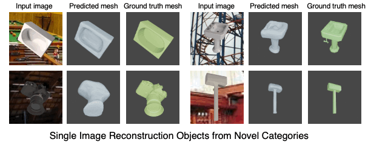

# 3D Reconstruction of Novel Object Shapes from Single Images

In this work we present a comprehensive exploration of generalization to unseen shapes in single-view 3D reconstruction. We introduce SDFNet, an architecture combining 2.5D sketch estimation with a continuous shape regressor for signed distance functions of objects. We show new findings on the impact of rendering variability and adopting a 3-DOF VC (3 Degree-of-Freedom Viewer Centered) coordinate representation on generalization to object shapes not seen during training. Our model can generalize to objects of unseen categories, and to objects from a significantly different shape dataset. [Link](https://arxiv.org/pdf/2006.07752.pdf) to our paper and [link](https://devlearning-gt.github.io/3DShapeGen/) to our project webpage.

This repository consists of the code for rendering, training and evaluating SDFNet as well as baseline method [Occupancy Networks](https://arxiv.org/pdf/1812.03828.pdf). Code to repoduce results for baseline method [GenRe](http://papers.nips.cc/paper/7494-learning-to-reconstruct-shapes-from-unseen-classes.pdf) can be found [here](https://github.com/devlearning-gt/GenRe-ShapeHD).

## Training and evaluating SDFNet and OccNet
Follow instructions in [SDFNet README](https://github.com/devlearning-gt/3DShapeGen/blob/master/SDFNet/README.md)

## Training and evaluating GenRe
Follow instruction in [GenRe README](https://github.com/devlearning-gt/GenRe-ShapeHD)

## Rendering
Follow instructions in [Rendering README](https://github.com/devlearning-gt/3DShapeGen/blob/master/Rendering/README.md)
